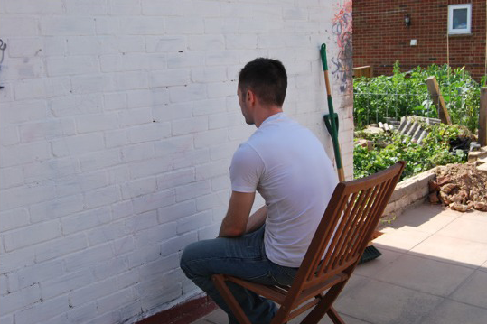

# A New Hope Appears...

This is the first post in my new blog. Stay a while and ~~listen~~ find out if you're as interested in reading it as I am in writing it (aka... moderately.) 

When considering starting a blog, I asked myself some questions to try and figure out if there's value in contributing to the noise that is the Internet.

**Figure 1: The Internet**

The questions boiled down to:
- What's the value in me (specifically) blogging? (both to myself and to the reader who totally exists)
- What topics should I cover?
- What meets "the bar" for qualifying for a new post?

Today, I'll jot down my answers to these questions and, in doing so, hopefully convince you that there's some value to be found here.

# Why (a) blog?
## Value to You
I often come across odd problems I don't see answered anywhere on the Internet (at least, not in a single place) and spend hours, days... weeks investigating the answer. I'd like to be able to contribute the results of that work back to the community, even if that "community" is only a few readers. I hope to present topics with a touch of humor (though it is _my_ humor, so how much that resonates with others remains to be seen.)

You also get my opinion. While that's of questionable value, I do try to put a lot of thought into things I write and present them in a structured, understandable manner with some humor.

**Figure 2: Me hoping you agree there's some value to this**

## Value to Me
I think it's important that all involved parties know what they're getting out of any sort of interaction like this (something I'd love to see tech companies do, but that's neither here nor there.)  As such, I'm going to be as transparent as I can about why I'm doing this.

Selfishly, writing a blog post forces me to consider topics in more than a passing capacity - I actually take a step back and collect thoughts and information on topics.  This helps to both mature and solidify opinions (sometimes changing them),  as well as providing a time capsule of my thoughts for me to look back on, even if no one else reads the blog (which is 100% not the most likely outcome.)

# Topics
My likely topics are going to be quite varied, and I likely can't do it justice upfront. Instead, here's a brief overview of some of my interests, which are most likely to be drawn from when writing future posts.

Professionally, I work in Information Security, with a BS and 10 years of experience. This means that both security and privacy are pretty much always at the forefront of my thinking, but these also tend to be very dry topics.

**Figure 3: Listening to someone talk about security**

I also like various board games (my favorites are [Star Wars: Armada](https://boardgamegeek.com/boardgame/163745/star-wars-armada), [Magic Maze](https://boardgamegeek.com/boardgame/209778/magic-maze), and [Gloomhaven](https://boardgamegeek.com/boardgame/174430/gloomhaven) - some friends may help with board game-related posts in this area) and video games (favorites are [Arma 3](https://www.youtube.com/watch?v=Hyz5Hj53DuM), [The Witcher 3](https://store.steampowered.com/app/292030/The_Witcher_3_Wild_Hunt/), and [Dark Souls 3](https://steamuserimages-a.akamaihd.net/ugc/2128572842574996425/C8492ECDBE97E0E0D0444929D673249D462E75F9/?imw=5000&imh=5000&ima=fit&impolicy=Letterbox&imcolor=%23000000&letterbox=false).)

Also interesting to me is programming - these days, most of my coding goes toward creating modules and systems for [Foundry VTT](https://foundryvtt.com).

**Figure 4: Tim attempting to code something**

Also in this bucket is flying, both in the meat world and in virtual space.

**Figure 5: Someone else at the controls** 

**Figure 6: Me at the controls**

**Figure 7: Real life flying (Bay Area, CA)**

And, to wrap it all up, I enjoy tabletop RPGs such as [Star Wars FFG](https://www.fantasyflightgames.com/en/starwarsrpg/) and [Paranoia](https://www.mongoosepublishing.com/products/paranoia-red-clearance-starter-set-1) (both of which are more narrative than [D&D](https://en.wikipedia.org/wiki/Dungeons_%26_Dragons), which I have come to dislike.) Sorry, no funny pictures or clips of these.

# Quality & Format
"The bar" is still under consideration, and will probably shift over the first year or so of posting, but I imagine it will be higher for more serious topics - by which I mean, anything about InfoSec or privacy will likely be well-thought-out, with nuanced views presented, whereas less serious topics like video games may get initial thoughts.

I will attempt to use a format which presents a problem, explains why it's a problem, my thoughts on the matter, and some relevant resources to learn more about it. This, too, will likely shift over time and become more standard as I find something which works well.

# Like What You See?
This blog offers an Atom feed [you can subscribe to](https://leetsaber.com/feed.xml) if you're as excited as I am about this journey (ok... excited at all).

**Figure 8: An Atom feed**

... wait, that's not right. [Atom feed](http://www.differencebetween.net/technology/difference-between-rss-and-atom/).

## An Aside
While researching how I wanted to notify people of new posts and collect as little information as possible (which is apparently quite the challenge these days), I spent a good chunk of time trying to find an RSS reader which doesn't require an account or try to upsell you. Apparently that concept is long gone (unless you use the [Vivaldi](https://vivaldi.com) browser, which offers built-in following with no account creation!) If you don't currently use an RSS/Atom reader and are just so excited about new content that you've decided to grab one, I'd recommend  [Inoreader](https://www.inoreader.com/). It requires an account, but at least it doesn't try to upsell you every chance it gets.

# Contact me
Feel free to email me at `blog at leetsaber.com` with comments, complaints, compliments, or anything else you can think of.
