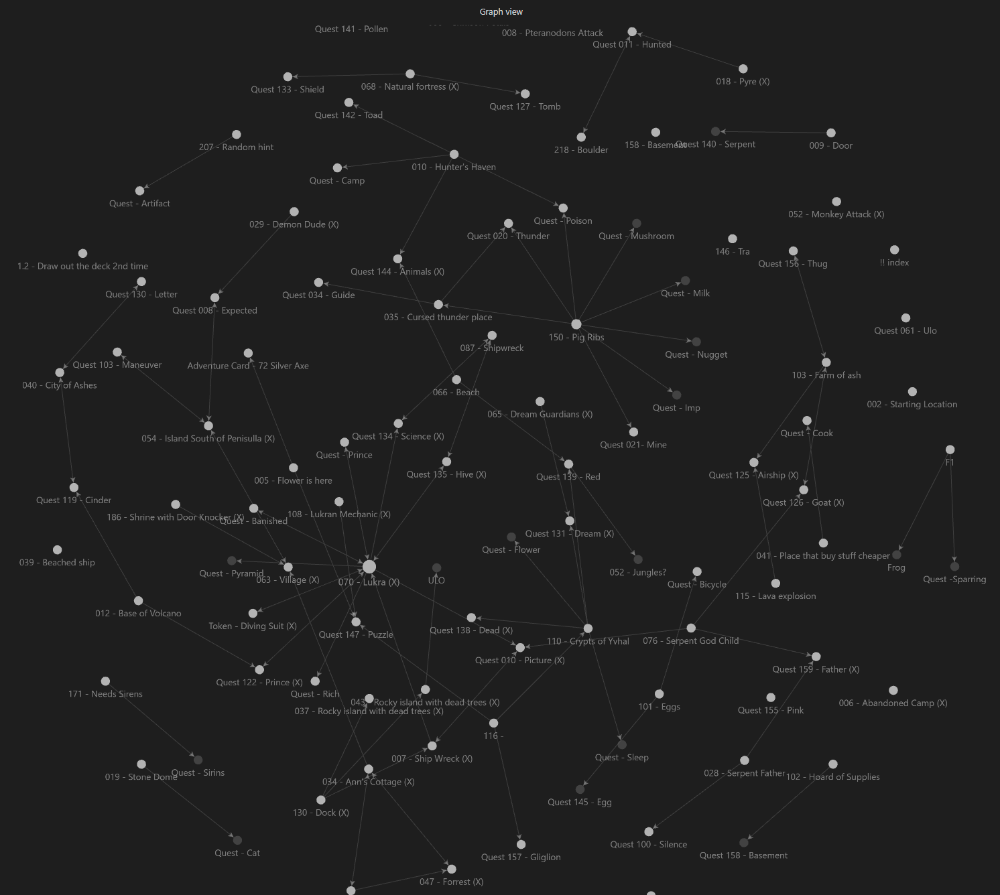
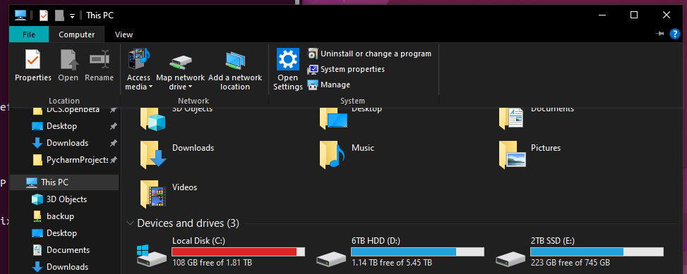
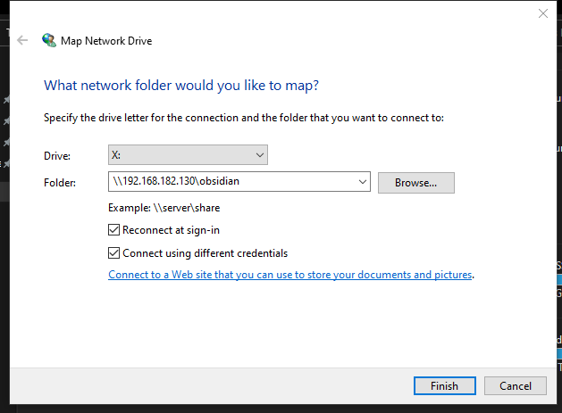
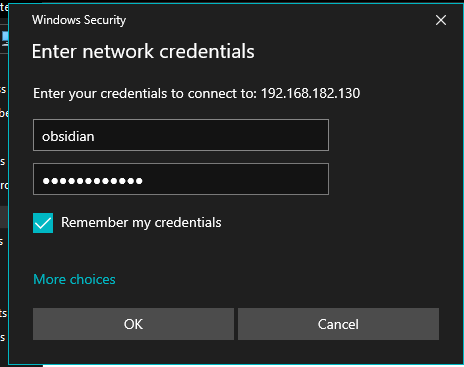
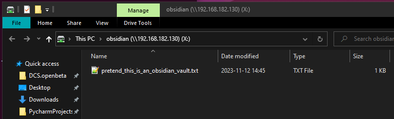
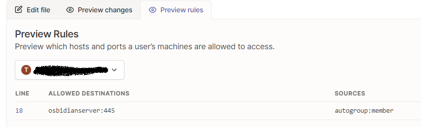
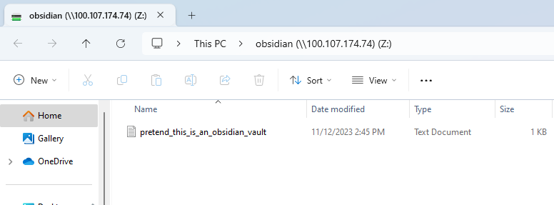

## Discovering the Conversation
I was reading [Tildes](https://tildes.net), my conversation-inducing replacement for Reddit, the other day, when I saw an interesting thread about some software that I use called Obsidian.  [Obsidian](https://obsidian.md), for those that don't know, is a "writing app." While "writing app" sounds about as entertaining as listening to someone talk about security, it does have some interesting attributes:
- it's free
- it uses [markdown](https://www.markdownguide.org/getting-started/), making it super simple to use (no complicated menus to learn)
- it supports community-developed plugins
- it's entirely local to the device you're using (it has no data snooping)
- it's super easy to link to other notes
- it has a handy-dandy "canvas" mode, allowing the easy creation of images I'd previously use draw.io to create
- it has a much-praised "brain graph" feature which I haven't been able to make any reasonable use of yet



**Figure 1: A friends graph view after a campaign of [Sleeping Gods](https://boardgamegeek.com/boardgame/255984/sleeping-gods)**

## The Conversation
The [Tildes thread](https://tildes.net/~tech/1bsq/people_who_use_obsidian_or_other_research_apps_what_service_do_you_use_to_sync_between_devices) I read posed the question:
> What service do you use to sync Obsidian between devices?

This struck me as an interesting question because I use Obsidian and have encountered this problem.

I saw several solutions suggested:
- Google Drive / iCloud / [NextCloud](https://nextcloud.com)
- [rsync](https://en.wikipedia.org/wiki/Rsync)
- paying for the sync functionality (this is how Obsidian makes money)
- a totally different application which offers sync built in

As is tradition on the Internet, a few of the suggestions made me question humanity:
- Couch DB
- git


 
**Figure 2: Me reflecting on expecting a sane answer about literally anything online**

## The Underlying Issue
From the moment I read the thread title, something was nagging me. It just... didn't feel right. 

The question (taken literally) assumes that the goal is to _sync_ the contents. Syncing generally means that you have multiple independent sources which need to be combined. This approach inherently introduces a potential flaw: if, for whatever reason, a sync does not successfully execute (or executes partially), things don't go well and data gets lost. Git does somewhat resolve this, but it feels very heavy-handed compared to the intended use case.


**Figure 3: Where you find yourself when you edit the same file in two different locations and try to merge it**

# Introducing Another Solution
## The Solution
I actually draft my Blog posts (yes, I can say "posts" now - this will be the second, so it's plural!) using Obsidian. I do so from a combination of my desktop and laptop, meaning that I have faced (and had to solve) this exact problem. The solution I arrived at was to create a [Samba](https://www.samba.org/samba/what_is_samba.html) share and mount it on both devices. 
## An Amazing Solution
Writing to a network share has some advantages. First of all, it completely circumvents the "sync" problem by using a centralized location to store the information. It also makes it fairly easy to add additional devices into the mix. And, because Obsidian stores settings on a per-"Vault" basis, all settings remain consistent across devices. This also means you retain full control over the data and the "sync" solution does not permit a 3rd party the ability to read (or delete) your data.
## An Obvious Problem
As I was writing this post, feeling so happy that I had an awesome solution to share with people, I realized this solution doesn't work if you ever leave home (at least, not securely!) Luckily, a friend recently introduced me to a service called [Tailscale](https://tailscale.com).


**Figure 4: Come to think of it, a vacation sounds lovely**

## Tailscale
Tailscale is a minimal-config program which allows you to quickly and securely access a single port/application from anywhere. I currently use this to allow friends to join my Minecraft server without actually exposing it to the Internet (thanks [log4j](https://builtin.com/cybersecurity/log4j-vulerability-explained)), but it works for this case as well. By joining both the machine hosting the share and the (presumably) laptop accessing it to Tailscale, you can access that network drive from anywhere[^1].
## The Bad Stuff
Of course, this solution has several downsides. Which may be major downsides, depending on your preferences.
1. By not syncing, we rely on an active Internet connection. You can't use this solution while in airplane mode
2. This requires having access to a device which is powered on whenever you need access to it - likely, this will mean 24/7
3. You must be dedicated and/or tech-savvy enough to set up a share of some sort

# Closing Thoughts
While this is by no means a perfect solution - and may only have worked for me because I already had all the components in place-, it does avoid the major pitfall of syncing files while providing some nice benefits in a privacy-friendly way.


---


# The Setup
If you want to do this yourself, I've included the relevant steps below.  At a high level, this involves:
1. Installing and configuring Samba
2. Installing and configuring Tailscale
3. Configuring your clients

## Samba
1. Install Samba
```bash
sudo apt-get install -y samba
```
2. Add these lines to `/etc/samba/smb.conf`
```yaml
# under global
# require strong protocols
server min protocol = SMB3_11     
# require strong protocols
client ipc min protocol = SMB3_11             
# prevent impersonating the server
server signing = mandatory        
# prevent impersonating the client
client signing = mandatory        
# require the connection to be encrypted
smb encrypt = required            
# disallow anonymous access
restrict anonymous = 2   
disable netbios = yes
# no netBIOS or SMB1, so only listen on 445
smb ports = 445
```
3. Create the share for the Obsidian files to be hosted within (also in `/etc/samba/smb.conf`)
```yaml
[obsidian]
# path to the user
path = /home/obsidian/smb
# permit it to be browsed by clients
browsable = yes
# permit clients to write to the share
writable = yes
# only allow users to connect as a single, dedicated account
valid users = obsidian
# again, permit clients to write to the share
read only = no
# regardless of who the client auths as, force them to act as "obsidian"
force user = obsidian
# make it so only our specified user can read the files they create
create mask = 0700
# but do allow browsing the filestructure
directory mask = 0744
```

Add a user to access the share. Note their password here is not used for the share.
```bash
sudo adduser obsidian
sudo smbpasswd -a obsidian
sudo -u obsidian /home/obsidian/smb
```
Lastly, confirm that you can access the share. On windows:

Open explorer -> computer -> map a network drive



Enter the server IP and make sure to check `connect using different credentials` (use the credentials you specified in the `smbpasswd` step)



Enter the user and password you selected in the `smbpasswd` step. You'll likely want to check `remember my credentials`.



You can now create a new obsidian vault on the resulting drive!



## Tailscale 
Now that we have Obsidian accessible on your local network, we need to set up Tailscale to make it remotely accessible. The next steps assume you've created a Tailscale account already.

Download tailscale on the server and link it to your account following the on-screen instructions.
```bash
curl -fsSL https://tailscale.com/install.sh | sh
sudo tailscale up
```
Once it's configured, we'll need to make some ACLs to only permit access to the SMB server we just configured. The following JSON should work (you'll need to update the IP address.)
```json
{
    "hosts": {
        "osbidianServer": "100.107.174.74",
    },
    "acls": [
        {
            "action": "accept",
            "src":    ["autogroup:member"],
            "dst":    ["osbidianServer:445"],
        },
    ],
}
```
To make sure you've done it correctly, you can go to "preview rules" - it should look like this:



`autogroup:member` is a Tailscale-managed group which represents all users on your tailscale account. Using this group means you'll automatically provision access to others on your account, e.g. family or significant others. You can read the docs to get a more (or less) restrictive version, if preferred.

### We're Almost Done, I Swear
On your client, install Tailscale following the same steps above.

Set up the network share again, this time pointing it at the tailscale IP address (found at [https://login.tailscale.com/admin/machines](https://login.tailscale.com/admin/machines))


You should see the same network drive show up. Huge success! Finally, you open a vault and access it from anywhere you have an Internet connection.



---
{: data-content="footnotes"}

[^1]: See a problem? Just keep reading. I cover it.
