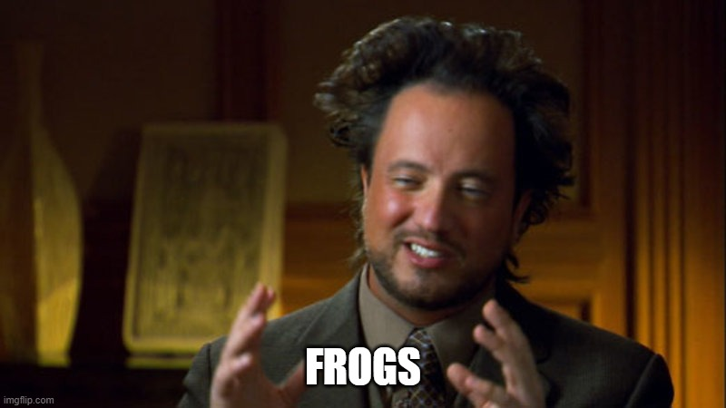
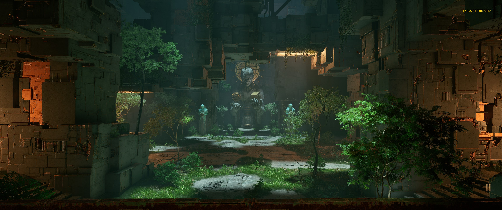
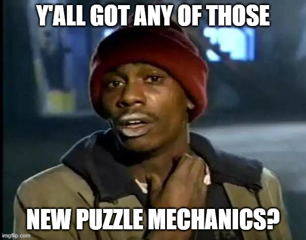
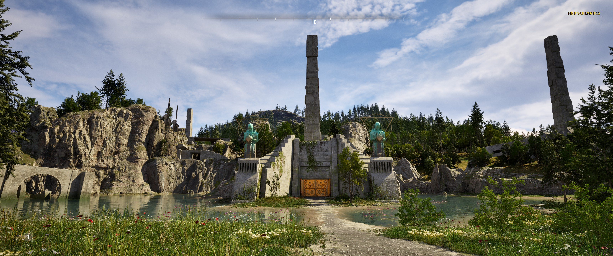
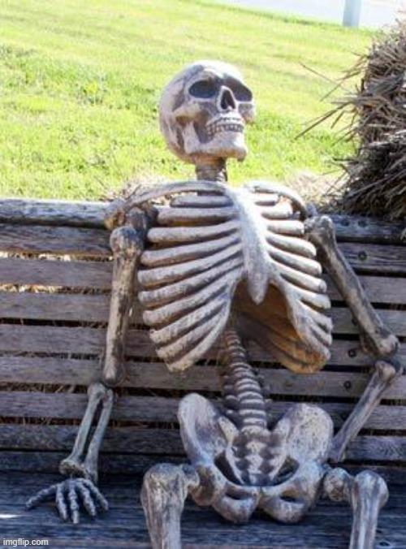
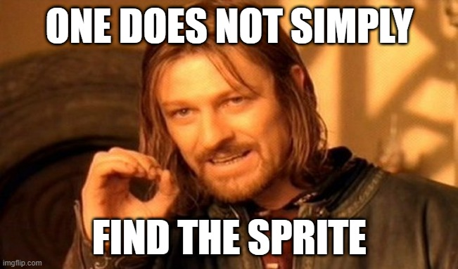
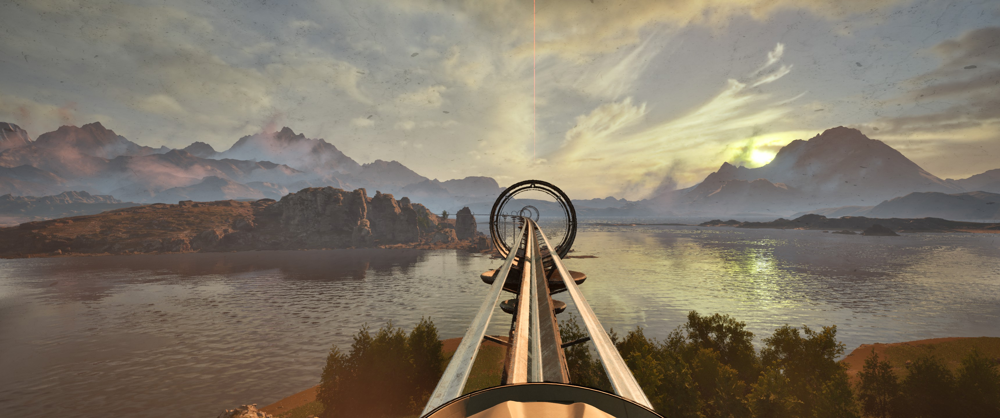
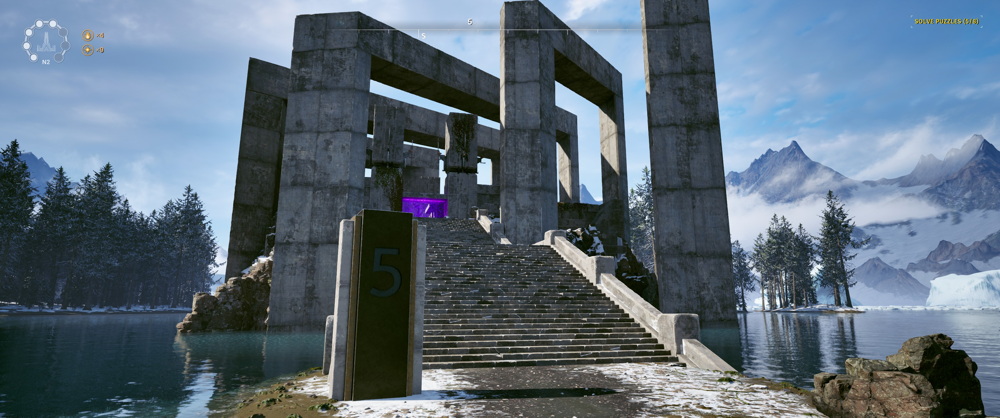

# Stats

`Platform`: PC

`Input`: Mouse & Keyboard

`Mode`: Single player

`Release Date`: 2023

`Gametime`: 0 at start, 25 at end (25 hours total)

`Date Played`: December 2023

`Finished`: Yes
# Thoughts
## What Is It?
[The Talos Principle 2](https://store.steampowered.com/app/835960/The_Talos_Principle_2/) is a 3d puzzle game in which you are exposed to, and invited to partake in, philosophy. Yeah, it's weird like that, and it gets even weirder, asking questions like "can you feel compassion for a frog and still eat it?" and "what is nature? Is it **good**?"

**Figure 1: Me philosophizing about frogs**

## Initial Thoughts: Wow
I have to say, I was surprised with how beautiful the game is. While the first game is certainly not ugly, the second represents a huge step forward. In The Talos Principle 2, you traverse terrain made up of various distinct biomes and have incentives to encourage (but not require) further exploration through the beautiful landscape, such as secrets. It always feels like there's something else to discover - if you just spend a little more time looking around...

**Figure 2: The game "wow"s on the regular**

The puzzles were fun without being overly challenging, and I got more and more excited as new mechanics were introduced, constantly looking forward to what was coming next. The puzzle mechanics in this game are top-notch and are really fun to play with. Some of the ideas introduced took some time getting used to and forced me to reevaluate how puzzles can be done.

**Figure 3: I don't have a problem!**

## Final Thoughts: Thank Goodness It's Over
As the game came to a close, all I could think was "thank goodness!" While I quite enjoyed most of the exploring I did, there was just... so much content.  Despite all of my running around, the bonus puzzles were locked until the very end of the game - at which point I was ready to move on. I like to do a challenge and then enjoy a bit of laid-back time before going back into a new challenge, but this approach meant I had to beat a bunch of easy puzzles (and they were mostly fairly easy, rarely requiring I take a step back and think things through) back-to-back before being _awarded_ the chance to do a bunch of _challenges_ back-to-back. It just wasn't my jam. Nice try, Lonestar.

**Figure 4: The bane of my existence. Challenge puzzles.**

## Least Favorite Things: Poor Gameplay Mechanics
I have to admit, there isn't a lot I didn't like about this game (despite my closing thoughts.) So let's get right into the worst parts!
Timing puzzles. The bane of all ...puzzlers. De-puzzlers. Puzzle solvers. Gamers. People. These involve waiting to perform an action until a specific time in order to progress the puzzle. If you get anything wrong, you're _forced to wait for the world to be in a state where you can progress again, even if you know the puzzle solution_. This makes them a very frustrating mechanic, and The Talos Principle 2 has several such puzzles, detracting from an otherwise good experience.

**Figure 5: Someone waiting for me to figure out how to refer to people who solve puzzles**

Another point of contention is one of the secret objectives (which is secret in the same way that the white gummy bear smoothie at Jamba Juice is secret.) For this objective, you have to find a sprite hidden in the world and then... follow it to another point in the world. Except the sprite takes deliberately annoying paths while you follow it. Following it adds nothing to the experience (it's a puzzle game, so there's no risk or action) and actively takes up time trying to guess where it'll abruptly turn on before you're finally treated as having "solved the puzzle." 

**Figure 6: Why is this sprite following even in the game!**

## Favorite Thing: What's That?!
Oh my goodness. This game offers such a sense of discovery. Of wanting to see what's next. Whether it's being excited about the next puzzle mechanic, the next biome, the next discussion about frogs, or just where the story is going next, I had a sense of wonder throughout the game which few games offer. The game is also consistently hopeful. Even when people disagreed with each other, they all want to make the world a better place and simply disagree on how to enact that shared ideal.

**Figure 7: Seriously. It made my eyes bleed with beauty. The games beauty, that is. I didn't bleed beauty. That'd be weird.**

## Most Surprising Thing: Puzzle Design
The puzzles in this game sit at an odd intersection between too easy and too difficult (no, that doesn't mean they were perfect!) The primary puzzles are mostly easy - even the end-of-game puzzles seem to rely on the scale of the space they are in (preventing you from seeing all the components at once) rather than actually becoming more complex - and the bonus puzzles rely on you understanding _every piece of how every puzzle tool works_, including in weird edge cases. I have been known to be grumpy sometimes, so this might just be me, but I was hoping to see complex puzzles - with more interactions between set pieces - rather than requiring an extremely deep understanding of how laser beacons interact when receiving three signals and emitting two signals at once. 

**Figure 8: Puzzles are in self-contained buildings in a larger world. Neat.**

## Conclusion
Overall, I enjoyed the game. It was fun to see a bunch of new puzzles and to constantly be asked for my opinion on interesting topics, only to have it dissected and ripped to bits. However, the complaints I had actively stopped me from loving it, even pushing me to feel relief that the game was over. As such, I give the game a `4/5`.
### Scoring System
1. Hated it. Did not finish
2. Disliked it, but finished
3. NO strong feelings one way or another
4. Liked it
5. Thoroughly enjoyed it. Can't wait to play it again
