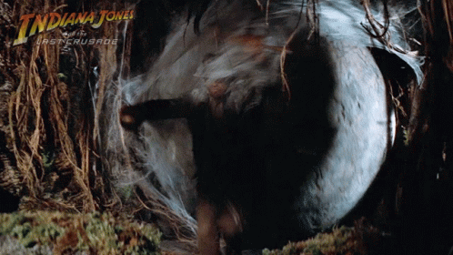
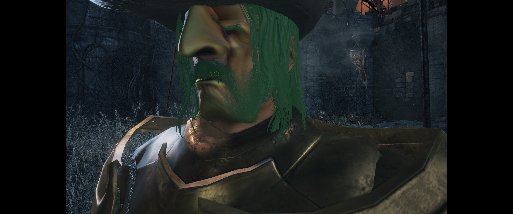
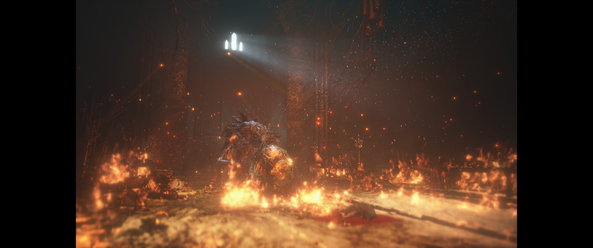
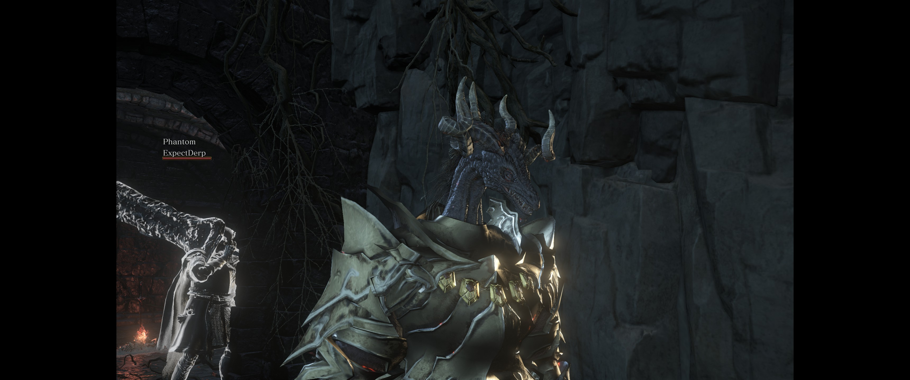
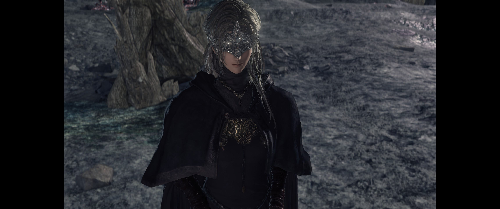
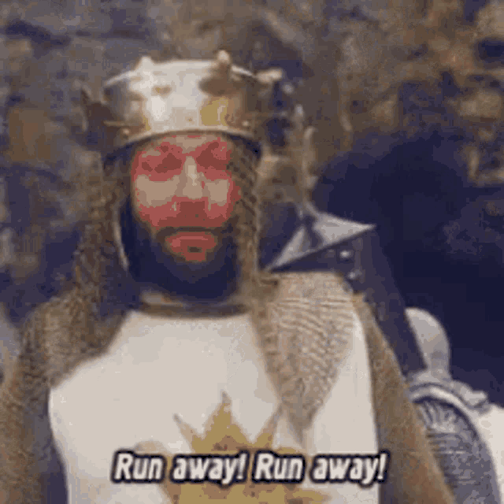
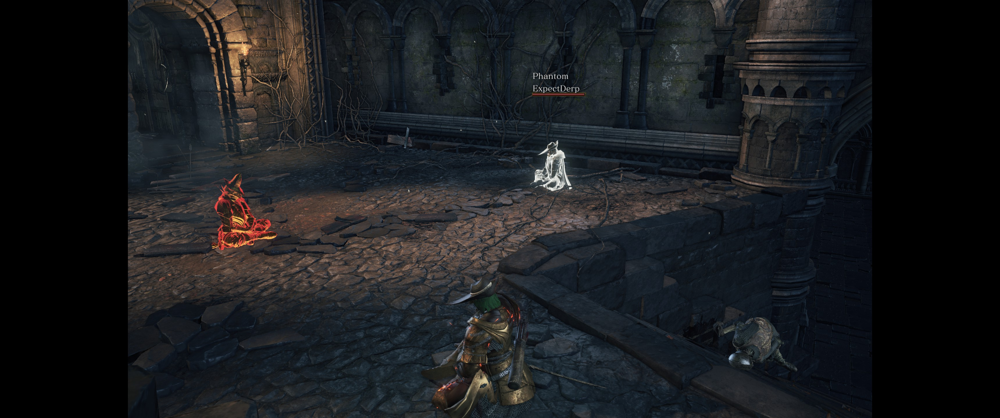
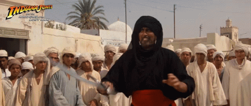

# Stats

`Platform`: PC

`Input`: Xbox One Controller

`Mode`: Co-op

`Release Date`: 2015

`Gametime`: ~230 hours at start, ~290 hours at end (~60 hours)

`Date Played`: December 2023

`Finished`: Yes
# Thoughts
## What Is It?
[Dark Souls 3](https://store.steampowered.com/app/374320/DARK_SOULS_III/) is the third installment in a series famous for ~~making people rage-quit~~ being difficult. It's an action RPG set in a dark fantasy world where you play an undead attempting to relight the fire which has gone out in the world.  ...at least, I think that's what is happening. The game is _very_ light on story and, while it does offer details about the world and what's happening, leaves the player to draw their own conclusions about what that means. For me, this means running around desperately trying not to die to the various traps, enemies, bosses, player invaders, and other such mishaps. And largely failing.

**Figure 1: Me "evading" traps**

## Initial Thoughts: Excited for What's to Come
Dark Souls is one of my favorite series - so much so that starting the game for my fifth or six playthrough left me with a sense of excitement about the upcoming challenge and seeing how my skills have improved after playing Elden Ring for... _checks notes_ hundreds of hours. Despite having just come off of the gorgeous game that is Elden Ring, Darks Souls 3 didn't look particularly bad, unlike the early entries in the series. And, of course, I was looking forward to the smaller and more interconnected world of DS3 over Elden Ring. 

**Figure 2: Even old, the game is pretty. Much like my character**

**Figure 3: Ok, fine. The game certainly has some beautiful scenes**

## Final Thoughts: Still An Amazing Game
My love for Dark Souls 3, like that for a child or pet, has only strengthened over time. It's probably the only co-op game I've played through in its entirety with everyone willing to play with me, and I've yet to alter my playstyle at all! The game does a masterful job with the play experience: making you weary of traps by placing them, but making it very easy to ignore that weariness by placing them sparingly. It's just often enough that you know you _should_ be checking for them, but infrequently enough that you really want to stop looking for them. And it does this for pretty much everything.

I will, however, note that - after doing the entire game (including DLC) in co-op - the final boss was a cake-walk. Not only did we beat it on the first try, we both finished our fights with more than half of our health potions left. This actually bleeds over to some other bosses of the game, too. While I do really enjoy the ability for me to pick my own progression path (and blame any lack of skill on being in an area too early), it sometimes robs certain fights of any tension or real sense of accomplishment for completion.

**Figure 4: I mean, I might have had to turn my head into a dragon. But it was still _easy_...**

## Least Favorite Thing: But Why Can't It Be Better?!
I have two major complaints with this game. The quest progression and invasions.

Quest progression. Oh my god. Many quests seem to be basically impossible to run to completion without the usage of a guide of some form. They require going to very specific areas (often ones you've already been to) at very specific times and, sometimes, doing very specific things. This wouldn't be so bad if the game gave you anything more than the vaguest of hints on how to progress them. You don't really lose anything by not doing the quests, so it doesn't _really_ detract from the experience that much, but I'd really like to be able to complete more of them without the immersion-breaking guide following.

**Figure 5: There's a quest involving this lady. Or so I've been told.**

Invasions are straight-up my least favorite part of the game. For anyone who isn't aware, the series includes some online functionality which does some really neat stuff. Players can leave messages for each other from a canvas of pre-selected words to help (or hinder) each other. You can briefly see "ghosts" - faint outlines - of other players briefly. You can even see how and where other players died. Or you can "summon" NPCs or other players to play cooperatively. The thing is, to access any of these features, you must use a consumable item. And doing so makes you eligible for invasion. This is where other players can forcibly join your world with the specific goal of killing you. While death in the series in common, it's very frustrating to have progress being made with a friend reset (you _already_ have to play through the entire game twice to play co-op - once per region for each player) **and**, if you die to these people who often specialize in invading, you must use another consumable to re-enable multiplayer features (and continue your co-op adventure.) To make matters even worse, invaders will sometimes use super-powerful weapons or refuse to actually fight you, running away and hiding. You end up massively overpowered by playing co-op, so even if you end up killing every invader, it only makes the problem worse (while, ironically, leaving you under-equipped to deal with invaders using late-game equipment.)

**Figure 6: My reaction to every invader**

To be fair, my co-op partner and I managed to establish tentative truces with some invaders, who turned out to be very helpful people. But the vast majority would kill us on sight, regardless of the action we took.

**Figure 7: We tamed an invader. Who's a good boy?!**

## Favorite Thing: Personal Progression
The gradual shift in _player_ skill, not player character power, throughout the game is one of my absolute favorite things about this series. It masterfully breaks you down and then helps you build yourself back up. Nearly every time I failed, it felt like _I_ did something wrong. I regularly even call it out to myself - "rolled too early", or "swung my sword too late," or "mistook one move for another, I need to wait longer to determine which is move it actually is." Make no mistake, this is a difficult series. Early game enemies can still kill you easily by the time you're at the end of the game. But death isn't punished. You drop whatever money you had on you when you died, but if you make it back to that spot without dying again, you can recover it. Beyond that, no permanent penalty is incurred. It very much feels like the game wants you to tinker with strategies, and to celebrate your failures as a way to learn and gain a deeper understanding of what's happening. Your ability, as a player, to return to the starting area and stomp enemies who were initially difficult to kill due to how the game has taught you to read and anticipate what an enemy is going to do is a feeling few games invoke. It isn't just giving you stronger gear, it's honing a consistent set of skills throughout your playtime.

**Figure 8: Me demonstrating the super amazing skills I picked up during the game**

## Conclusion
Dark Souls 3 is one of my favorite games of all time. It represents a masterful implementation of the Dark Souls formula without overstaying its welcome. I love the challenge and how it feels to finally overcome those varied, and deep. To learn to slow down and take things in. How interconnected the world is. How things which appear to be setbacks are often helpful.  I don't think I've played a more rewarding series.  Despite its flaws, DS3 nets a `5/5`.

### Scoring System
1. Hated it. Did not finish
2. Disliked it, but finished
3. NO strong feelings one way or another
4. Liked it
5. Thoroughly enjoyed it. Can't wait to play it again