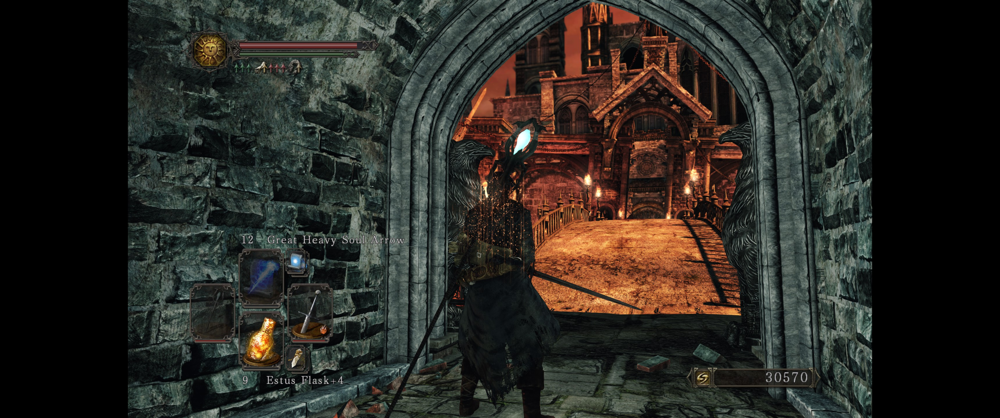
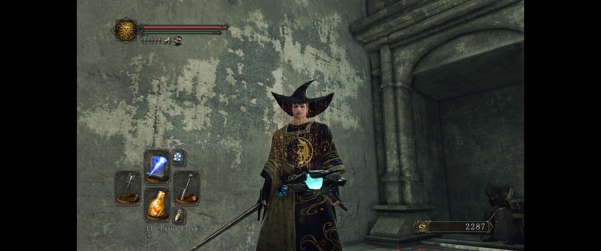
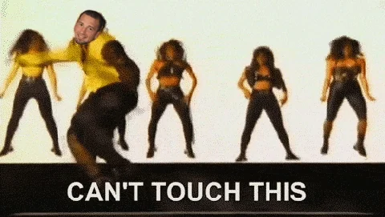
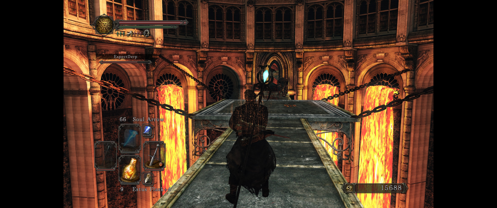
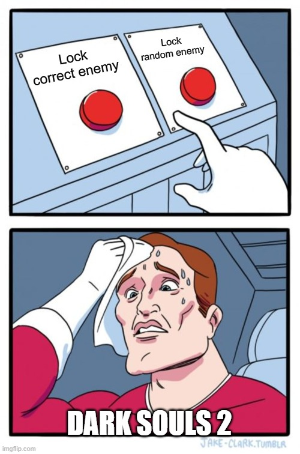
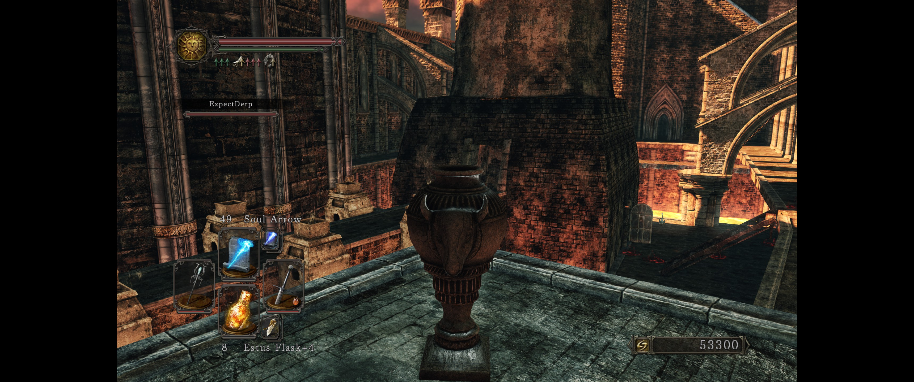
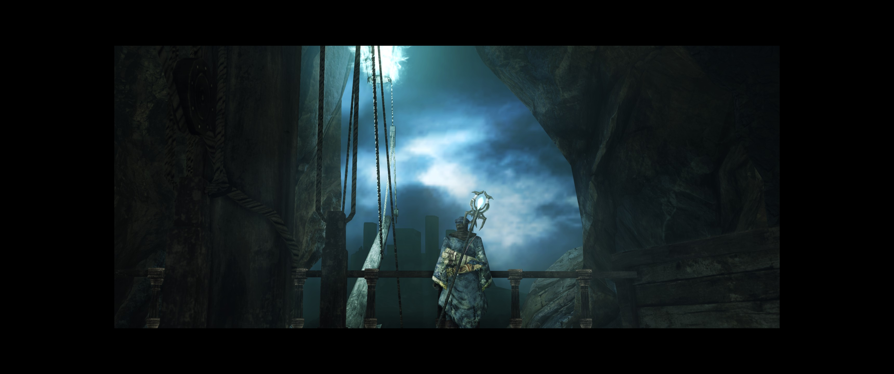

# Stats

`Platform`: PC

`Input`: Xbox One Controller

`Mode`: Co-op

`Release Date`: 2014 (PC)

`Gametime`: ~40 hours at start, ~90 hours at end (~50 hours)

`Date Played`: 2024

`Finished`: Yes
# Thoughts
## What Is It?
[Dark Souls 2](https://store.steampowered.com/app/335300/DARK_SOULS_II_Scholar_of_the_First_Sin/) is the second installment in a series famous for ~~making people rage-quit~~ being difficult. It’s an action RPG set in a dark fantasy world where you play an undead attempting to ...become king? I think? As always, the story eludes all but the most dedicated lore detectives. Like others in the series, Dark Souls 2 involves running around, desperately trying not to die to the various traps, enemies, bosses, player invaders, and other such mishaps. Unlike others in the series, it also involved largely _succeeding_ at these things, but more on that in the conclusion.

**Figure 1: "Mostly" succeeding will never include scary lava areas**

## Initial Thoughts: Should I even play?
Initially, I wasn't entirely sure that I wanted to play Dark Souls 2.  On one hand, this series is excellent and there's nothing quite like it. On the other hand, Dark Souls 2 deviates from the (now) successful formula of the series, and it shows.

**Figure 2: Me trying to answer "Will you play Dark Souls 2 with me or not?!"**

Eventually, however, I decided to go for it. The alternative was not having any souls game to play for MONTHS, and that was _simply unacceptable_. In order to try and gather some excitement for this game, I decided to try a class I haven't before: `psychology`. No, wait, that was college, though it went as well as what I did pick - `Sorcerer` - a magic-wielding buffoon who can kill people from exactly 5 feet away. Further way? Can't lock the target (a problem mostly unique to Dark Souls 2). Closer? Sorcerers are ranged characters and cannot possibly hit anyone that close to you!

**Figure 3: I did actually end up using an "s" word in conjunction with my magic-casting staff to overcome this shortcoming**

## Final Thoughts: HAMMER TIME!
Despite my strong complaints, the play through was actually quite nice. The game does stand above most Souls-like clones and delivers smooth and fair combat, wherein most enemies offer a challenge... if they manage to hit you. 

Which brings me to my next point - as a sorcerer, I think I got _hit_ by maybe 5 bosses through the entire game, which is an unbelievably low number (and is NOT a result of some extreme skill that I have in the game, believe me.) It was a cake walk for almost all enemies, to the point that I ended the game deciding never to play a sorcerer again.

**Figure 4: Me, as a Sorcerer. Apparently.**

There were very few invasions in our play through, which was a relief (you can see my post on Dark Souls 3 for my thoughts on _that_.) Of course, the invasions we _did_ have managed to cost me an item and a gesture, since the invader killed me while I was actively unlocking something, which apparently results in the item not being unlocked while simultaneously preventing unlocking it again. But I'm not mad.

## Least Favorite Thing: Movement
I have two major complaints with the systems and design of the game. The first is movement. I'm going to skip over the gory details, but Dark Souls 2 does not allow movement in arbitrary directions (which is standard in games) - instead, it forces movement in only one of 8 directions at a time.  Good thing this isn't a game all about avoiding traps, carefully moving around enemies, platforming on small ledges, and generally being very purposeful about every action you take, right?

**Figure 5: At least some of the ledges-of-instant-death are fairly wide**

Secondly, enemy locking. For those unfamiliar with the series, you are allowed to "lock" enemies by pressing a button. This causes your movement to shift from based on the direction you're looking to relative to the locked enemy, allowing you to generally (and easily) move _around_ enemies. Additionally, this causes range attacks (including most spells) to be cast at the target (instead of straight forward - as I said, Sorcerers in this game are not very smart.)  In Dark Souls 2, the locking is so poorly implemented I can't call it anything but "broken." It regularly refuses to lock enemies at all ranges and doesn't smoothly cycle between enemies, meaning that when it _does_ lock, it will pick the wrong enemy and be impossible to shift to the correct one.

**Figure 6: The Dark Souls 2 engine trying to lock the enemy I'm looking straight at from a foot away**

## Favorite Thing: Smoll summon sign
In the Souls series, when you kill certain bosses, you are no longer allowed to bring someone into your game in a co-op session. This is one of my least favorite things about an area - you can sometimes stumble into boss rooms (and you effectively can't leave a boss fight without losing your money), forget about wanting to go back and check something out, or simply not know about something until after you beat the boss. Dark Souls 2 introduces a tiny summon sign which allows co-op in areas where you have already beaten the boss - it simply limits how long your friend can be in the game for. This feels like an awesome middle-ground between having a co-op partner help you with an area exactly once (which is the stance every other game in the series takes) and allowing them to help you as if it was a true co-op game (which is what I'd personally prefer.) My partner and I used this many times throughout the second game, and it was lovely.

**Figure 7: I didn't screenshot something as benign as a tiny summon sign while playing. Enjoy this picture of me shape-shifted into an urn instead**

## Conclusion
The movement is implemented so poorly that I would have skipped the game... except that I was playing through the series with a co-op partner and was told that we *must* play each game. Although the quality is still at the level of Dark Souls, I can't really recommend playing the game if you're looking for an entry in the Souls series. If you consider it a random, tough game, you ...might find some enjoyment out of it. For me personally, Dark Souls 2 nets a `2/5`. Try Dark Souls 3 or Elden Ring instead. They're far superior entries.

### Scoring System
1. Hated it. Did not finish
2. Disliked it, but finished
3. NO strong feelings one way or another
4. Liked it
5. Thoroughly enjoyed it. Can't wait to play it again

**Figure 8: Seeing of the game. From a boat. Which I'm riding as it leaves. It makes sense, if you don't think about it at all**
