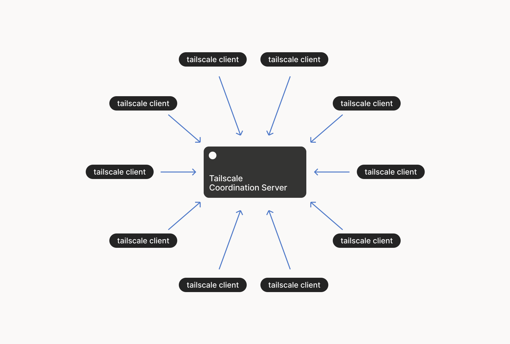

## What in the world is Tailscale?
Tailscale is a minimal-config program which allows you to quickly and securely access specific ports/applications from anywhere without exposing them to the Internet at large. It's a Virtual Private Network (VPN), but not in the traditional sense - it uses a lightweight protocol (WireGuard) under the hood and adds value by abstracting away the hardest part of actually using that protocol. The result is the ability to easily (trivially, even) set up access to any port from nearly any device for anyone. It's almost like taking candy from a baby!

**Figure 1: I said almost!**

For example, I currently use Tailscale to allow friends to join my Minecraft server without actually exposing it to the Big Bad Internet (thanks [log4j](https://builtin.com/cybersecurity/log4j-vulerability-explained)).  Tailscale also has nice additions like the ability to write access tests into your config, meaning you can set access which should always (or never) exist, enforced each time the ACLs are changed. It's a glorious idea; one that I hope catches on more broadly.

**Figure 2: I did say things I find cool would be as entertaining as my favorite pastime...**

After I gushed about Tailscale to a friend, they asked if it was actually safe to use. I replied that... I assumed so. And then, over the course of about 8 months, set out to test whether this highly-informed opinion was correct or not.

**Figure 3: I'm actually quite fast at writing. Compared to George R.R. Martin**

## Disclaimer
This post is not intended as professional security advice. I have not done an in-depth review of what the client is capable of doing, nor have I reviewed any of the code. _It is not a complete review and I would be ashamed if I saw something like this at work._

Additionally, this post is written under the assumption that Tailscale is not a hostile actor. Thought is given to a compromise of the underlying infrastructure, but the assumption is that generally, Tailscale is not working against you.

**Figure 4: This could be what happens in every Tailscale meeting, for all I know.**

## Concerns
Given that Tailscale has the intention of provisioning network access between devices, my major concern is that someone finds a vulnerability which enables access between different Tailscale networks (called Tailnets) and, by extension, my local network. Which is currently 100% secure. Pay no heed to the "Hello world!" server probably still running on my TV.

## How it Works
Unlike traditional VPNs, which can often be seen impersonating a snail, [WireGuard](https://www.wireguard.com) establishes point-to-point tunnels between nodes. This means traffic can be routed directly between the source and destination without having to be sent through a dedicated VPN server. In order to securely do this, a public/private keypair are associated with each IP address. To send traffic to a destination, traffic is encrypted with that IPs public key (and decrypted with the matching private key). Traffic received without a known encryption key for the sender is dropped without further inspection, meaning connections cannot be established to a device (over WireGuard) without those keys having been exchanged.

**Figure 5: Trying to send traffic to a node without that node having your key**

## The Architecture
Tailscale breaks down into two major components: the data plane (wherein nodes communicate with each other) and the control plane (wherein ACLs are configured).  

Within the data plane, Tailscale uses WireGuard to create point-to-point tunnels between nodes. Nodes perform mutual authentication using keys which are distributed via the control plane. This means there isn't a lot of risk here (assuming WireGuard is working and configured correctly and that the control plane is _behaving appropriately_), so let's move on to the control plane.

**Figure 6: Tailscale, every day. Hopefully.** 

According to Tailscale, the control plane exists as a `coordination server`. This server is used to distribute/update encryption keys (for nodes which are supposed to communicate with each other) and set ACLs. This design abstracts away the hardest problem in WireGuard - the need to safely distribute keys to allow nodes to talk to each other.

**Figure 7: How the coordination server works.** Taken directly from the Tailscale blog (linked below)

Here are the steps for adding a node to a Tailscale (taken directly from [tailscale.com](https://tailscale.com/blog/how-tailscale-works#the-control-plane-key-exchange-and-coordination)):
> 1. Each node generates a random public/private keypair for itself, and associates the public key with its identity.
> 2. The node contacts the coordination server and leaves its public key and a note about where that node can currently be found, and what domain it’s in.
> 3. The node downloads a list of public keys and addresses in its domain, which have been left on the coordination server by other nodes.
> 4. The node configures its WireGuard instance with the appropriate set of public keys.
> 
> Note that the private key never, ever leaves its node. This is important because the private key is the only thing that could potentially be used to impersonate that node when negotiating a WireGuard session.

The eagle-eyed among you may have noticed this also means that any compromise of the coordination server can be leveraged to expose nodes to unintended devices. In fact, [this has happened](https://tailscale.com/security-bulletins#ts-2023-001), though Tailscale claims it was not exploited.

**Figure 8: Anyone who noticed that this means you can get compromised by a coordination server compromise**

This is a wonderful example of the worst case failure. Just my luck!  And, almost as if Tailscale foresaw such concerns (and totally-not-exploited exploits), this vector can be partially closed by enabling [Device Approval](https://tailscale.com/kb/1099/device-approval#enable-device-approval-for-your-network), which requires that devices added to your Tailnet be approved (automatically or manually) before they can communicate with other nodes on it. Note that although enabling this would have mitigated the aforementioned failure, it does not fully mitigate the _risk_: Device Approval is configured (and approval is handled) via the same coordination server we're concerned about. 

Additionally, it's possible that the coordination server could publish new keys regardless of the setting (though I'm not sure if current clients would accept this, not having inspected the code). Regardless, Device Approval covers the most likely vector for unintended devices being added to your Tailnet.

**Figure 9: Totally not how manual approvals end up being done...**

### Conclusion
There is some risk involved with using Tailscale:
- If Tailscale wanted, I believe they could grant themselves access into your network
    - I have not audited the code and am not sure how ACL push/pull works, which is why this falls into the "I believe" category
    - Even if they don't have functionality which permits doing it now, an update to clients could grant it
- Attackers could connect to your Tailnet via a compromise of the coordination server (or the web app driving the configs it uses)
    - This can be almost entirely offset by enabling [Device Approval](https://tailscale.com/kb/1099/device-approval#enable-device-approval-for-your-network)

That being said, there's risk in using anything and I believe exposing services to the Internet involves far more risk than using Tailscale, simply because of the scope of exposure (literally anyone on the entire Internet). In the end, I think Tailscale is worth the trade-offs. Not to mention it's fun to play with!

**Figure 10: Me finding out that I agree with myself after some research**

Disagree? Think I missed something important? Feel free to contact me with complaints at `blogNotReal@leetsaber.com` (remove `NotReal`).

## Resources
I used these resources (among others) in researching this post. They might be helpful to you, too, so I've included them.
- https://tailscale.com/blog/how-tailscale-works
- https://tailscale.com/security-bulletins
- https://tailscale.com/kb/1099/device-approval#enable-device-approval-for-your-network
- https://tailscale.com/kb/1123/zero-trust
- https://github.com/juanfont/headscale